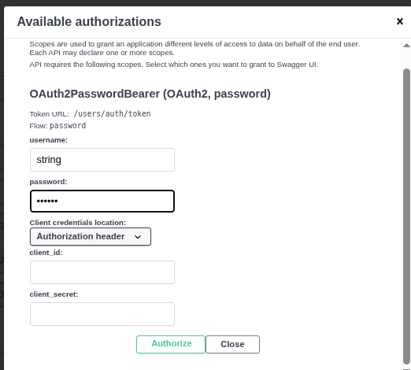

#  MSIO Technical Test / Metabolite API

API construite avec **FastAPI** pour gérer les utilisateurs et les **métabolites**, avec un système d'authentification sécurisée (JWT OAuth2).


Une fois toutes les étapes de configuration terminées (installation, migration de la base de données), vous pourrez accéder à l'interface de l'API à l'adresse suivante : http://0.0.0.0:8000/api/0.1.0/docs


## Stack Technique

- **FastAPI**
- **SQLAlchemy** (async)
- **PostgreSQL**
- **asyncpg**
- **Pydantic V2**
- **Passlib** (bcrypt)
- **Python-Jose** (JWT)
- **Uvicorn**
- **Docker**
- **docker-compose**

## Structure du projet
```bash
├── alembic.ini
├── data
│   ├── MetabolitesData_inputDataForTEst.csv
│   └── MetabolitesData_Upload_template.xlsx
├── docker-compose.yml
├── Dockerfile
├── ETL
│   ├── __init__.py
│   ├── insert_db.py
│   └── parser.py
├── migrations
│   ├── env.py
│   ├── README
│   ├── script.py.mako
│   └── versions
│       └── 2025-06-04_init.py
├── poetry.lock
├── pyproject.toml
├── README_hans.md
├── README.md
└── src
    └── msio
        └── backend
            ├── api
            │   ├── health
            │   │   ├── api.py
            │   │   ├── endpoints
            │   │   │   ├── health.py
            │   │   │   └── __init__.py
            │   │   └── __init__.py
            │   ├── __init__.py
            │   └── v1
            │       ├── __init__.py
            │       ├── metabolites
            │       │   ├── api.py
            │       │   ├── endpoints
            │       │   │   ├── __init__.py
            │       │   │   └── metabolites.py
            │       │   └── __init__.py
            │       └── users
            │           ├── api.py
            │           ├── endpoints
            │           │   ├── __init__.py
            │           │   └── users.py
            │           └── __init__.py
            ├── core
            │   ├── auth.py
            │   └── config.py
            ├── database
            │   ├── core.py
            │   ├── __init__.py
            │   ├── models.py
            │   ├── schemas.py
            │   └── session.py
            ├── __init__.py
            ├── log.py
            └── main.py

```

## Configuration

##### Générer la secret-key
```bash
python3 -c "import secrets; print(secrets.token_urlsafe(64))"
```

##### Si le fichier .en n'est pas présent crée un fichier `.env` à la racine avec les variables suivantes :

##
```env
POSTGRES_HOST=postgres_backend
POSTGRES_USER=admin
POSTGRES_PASSWORD=admin
POSTGRES_DB=backend
SECRET_KEY=vfXZwzgMi4rBC0F6OVANeYdebh_5l24GbKnFle88Tkfu2wumD8uoIAvT-4B5bHSs0-RJkoZwA8eiIfp4QRPHtA
ALGORITHM = "HS256"
ACCESS_TOKEN_EXPIRE_MINUTES = 60
```


## Lancer l'environnement de développement

Pour exécuter l'application ainsi que les services nécessaires (PostgreSQL, backend, pgAdmin), utilisez la commande suivante depuis la racine du projet :
```bash
docker compose up --build
```
Cette commande va :

- Démarrer PostgreSQL (base de données)
- Démarrer le Backend FastAPI : http://0.0.0.0:8000/api/0.1.0/docs
- Lancer pgAdmin pour visualiser et gérer la base de données: http://0.0.0.0:5050/


## Gestion des migrations avec Alembic
### Créer une migration
Pour générer une nouvelle migration automatiquement à partir de tes modèles SQLAlchemy :
```bash
docker exec -it backend poetry run alembic revision --autogenerate -m "Ajout <description>"
```

### Appliquer la migration
Pour appliquer la dernière migration à la base de données :
```bash
docker exec -it backend poetry run alembic upgrade head
```

## Importer les métabolites avec un script ETL
Un script Python permet d'insérer automatiquement des métabolites dans la base de données à partir de fichiers CSV.

#### Chemin du script

Le fichier se trouve dans le dossier ETL/ à la racine du projet :
```bash
├── ETL
│   ├── __init__.py
│   ├── insert_db.py
│   └── parser.py
```

#### Exécution du script dans le conteneur Docker
```bash
docker exec -it backend poetry run python ETL/insert_db.py
```

#### Sortie attendue
```bash
Inserted 16 metabolites into the database.
```


## Accéder à la doc Swagger
```bash
http://0.0.0.0:8000/api/0.1.0/docs
```

## Authentification via l'API FastAPI
#### 1. Envoyez une requête POST à /api/0.1.0/users/register avec un JSON comme ceci :


Cette étape crée votre compte utilisateur dans la base de données.

#### Se connecter (Login)

Envoyez une requête POST à /api/0.1.0/users/auth/token


Un token JWT vous sera retourné sous la forme :


## Authentification via Swagger
###### 1. Cliquez sur "Authorize" (en haut à droite)


###### 2. Renseignez :
-   username : ""
-   password : ""

Laissez les autres champs vides




Tu es maintenant authentifié et tu peux appeler toutes les routes protégées de l'API via Swagger ou Postman avec le token JWT.


# CLEAN PROJECT

### Stop all running containers
```bash
docker stop $(docker ps -aq)
```

### Remove all containers
```bash
docker rm -f $(docker ps -aq)
```

### Remove all images
```bash
docker rmi -f $(docker images -aq)
```

### Remove all volumes
```bash
docker volume rm -f $(docker volume ls -q)
```

### Remove  networks
```bash
docker network rm $(docker network ls -q)
```

### Remove build cache
```bash
docker builder prune -af
```